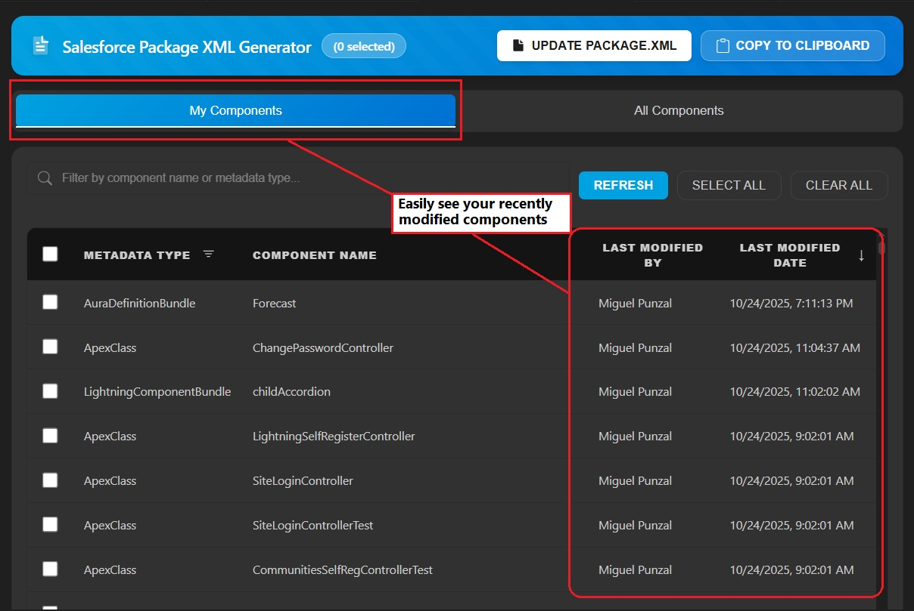
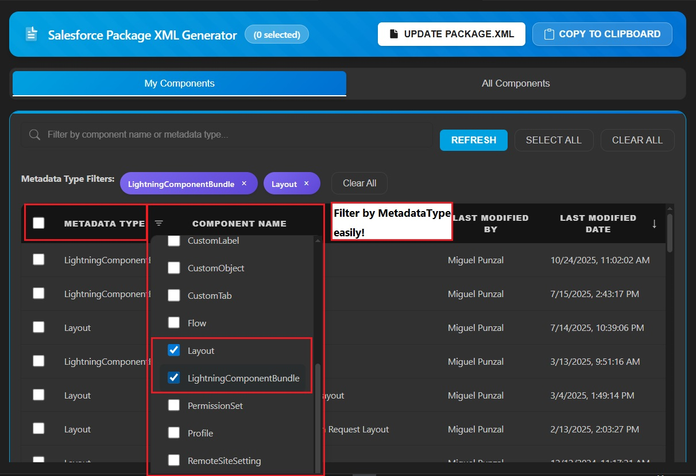
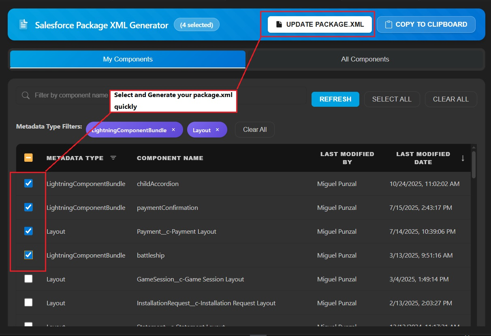

# Salesforce Package XML Generator Reloaded by Miguel Punzal

This extension provides an enhanced User Interface to choose metadata components for Package.xml file for development against sandboxes or DE orgs (Org Development Model with VS Code). This is similar to Eclipse Force.com IDE Add/Remove Metadata Components option, with additional features including tabbed views, advanced filtering, sorting, and "My Components" tracking.

> **Note**: This project is based on and extends the original work by vignaesh01 at [sfdx-package-generator](https://github.com/vignaesh01/sfdx-package-generator). Special thanks to the original author for creating the foundation of this tool.

## Screenshots

*My Components Tab - View and select components you last modified*

*All Components Tab - Browse all metadata components with advanced filtering*

*Package XML Generation - Generate and copy package.xml with ease*

## Features

### 🎯 Dual Tab Interface
- **My Components Tab**: View and select components that you last modified
- **All Components Tab**: Browse and select from all metadata components in your org

### 🔍 Advanced Filtering & Searching
- **Text Search**: Real-time filtering by component name or metadata type
- **Column Filters**: Multi-select dropdown filters for each column
  - Filter by component name
  - Filter by last modified user
  - Filter by modification date
- **Active Filter Display**: Visual chips showing currently applied filters
- **Context-Aware Filters**: Filters automatically adapt to available data

### 📊 Enhanced Table View
- **Sortable Columns**: Click any column header to sort ascending/descending
  - Sort by component name
  - Sort by last modified user
  - Sort by modification date
- **Sticky Headers**: Table headers remain visible while scrolling
- **Responsive Design**: Adapts to VS Code themes (light/dark mode)

### ✅ Smart Selection
- **Select All / Clear All**: Works with current filters (only selects/clears visible items)
- **Checkbox Selection**: Individual component selection with visual feedback
- **Indeterminate States**: Parent metadata types show partial selection state
- **Bulk Operations**: Select multiple components at once

### 👤 "My Components" Feature
- Automatically identifies components you last modified
- **Progressive Loading**: Components load incrementally with real-time progress indicators
- **Per-Type Caching**: Each metadata type is cached independently for faster subsequent loads
- **Selective Refresh**: Choose specific metadata types to refresh without losing other cached data
- **Last Refresh Tracking**: Displays when components were last fetched with visual warnings for stale data (>24 hours)
- **Smart Refresh Modal**: Search and filter available metadata types for targeted updates
- Queries 25+ metadata types including:
  - **Apex**: ApexClass, ApexTrigger, ApexPage, ApexComponent
  - **Lightning**: LightningComponentBundle, AuraDefinitionBundle
  - **Automation**: Flow, WorkflowRule
  - **Custom Objects & Fields**: CustomObject, CustomField (via FieldDefinition), ValidationRule
  - **UI Components**: Layout, CustomTab, CustomApplication
  - **Security**: PermissionSet, Profile
  - **Data Management**: Queue, Group
  - **Content**: EmailTemplate, StaticResource, ContentAsset
  - **Configuration**: CustomLabel, CustomMetadata, ExternalDataSource, NamedCredential, RemoteSiteSetting
  - **Analytics**: Report, Dashboard
- Shows modification history (who and when)
- **Clickable Rows**: Click anywhere on a table row to toggle component selection
- Generate package.xml from your components only

### 📋 Package.xml Generation
- **Update Package.xml**: Directly updates the manifest/package.xml file in your project
- **Copy to Clipboard**: Copies formatted XML to clipboard for manual use
- **Smart Formatting**: Properly indented and sorted XML output
- **API Version Detection**: Automatically detects and uses your org's API version

### 🎨 Modern UI
- Built with React and Material-UI
- Clean, intuitive interface
- Responsive design
- Dark mode support
- Loading indicators for async operations

## Prerequisites
Before you set up Salesforce Package XML Generator Reloaded, make sure that you have these essentials:

- **Salesforce Extensions for Visual Studio Code**
- **Visual Studio Code v1.76 or later**
- **Salesforce CLI (sf)** - The extension uses the new `sf` commands

## How to Use

### Initial Setup
1. Setup your project using **SFDX: Create Project with Manifest** command
2. Authorize your org using **SFDX: Authorize an Org** command
   - For more details refer to [Org Development Model with VS Code](https://forcedotcom.github.io/salesforcedx-vscode/articles/user-guide/org-development-model)

### Launching the Extension
1. Open the command palette:
   - Windows/Linux: `Ctrl+Shift+P`
   - macOS: `Cmd+Shift+P`
2. Run **Salesforce Package XML Generator Reloaded: Choose Metadata Components** command
3. The extension opens with two tabs: **My Components** and **All Components**

### Using "My Components" Tab
1. The tab automatically loads components you last modified from cache (if available)
2. **First-time load**: Components are fetched progressively with a loading indicator showing current progress
3. **Subsequent loads**: Cached components load instantly
4. **Refresh Data**: Click the **Refresh** button to update specific metadata types
   - A modal appears showing all available metadata types
   - Search to filter the list of types
   - Select specific types to refresh (8 common types pre-selected by default)
   - Click **Confirm** to refresh only selected types while preserving other cached data
   - Or click **Cancel** to close without refreshing
5. **Last Refresh Indicator**: Shows when data was last fetched
   - Displays timestamp at the top of the table
   - Flashes red if data is more than 24 hours old
6. Use the search box to filter components by name or type
7. Click filter icons to narrow by metadata type, last modified user, or date
8. Sort by clicking column headers
9. Select components using checkboxes or by clicking table rows
10. Click **Build Package.xml** to update your manifest file
11. Or click **Copy to Clipboard** to copy the XML content

### Using "All Components" Tab
1. Select a metadata type from the left panel (e.g., ApexClass, CustomObject)
2. The right panel shows all components of that type
3. Use search and filters to find specific components
4. Click on column headers to sort
5. Use **Select All** to select all visible components (respects filters)
6. Use **Clear All** to deselect all visible components
7. Click **Update Package.xml** when done selecting
8. Or click **Copy to Clipboard** for manual use

### Retrieving from Org
After generating package.xml:
1. Open the command palette
2. Run **SFDX: Retrieve Source in Manifest from Org**
3. Your selected components will be retrieved to your local project

## Features in Detail

### Smart Select All
The **Select All** button intelligently selects only the currently filtered/visible components. This means:
- If you filter by "Test", only components with "Test" in the name are selected
- If you apply column filters, only matching components are selected
- Your existing selections outside the filter are preserved

### Column Filtering
Click the filter icon (📊) next to any column header to:
- See all unique values in that column
- Select multiple values to show only matching components
- Clear individual filters or all filters at once
- Combine multiple column filters

### Package.xml Behavior
- **Update Package.xml**: Overwrites your existing `manifest/package.xml` file
- **Copy to Clipboard**: Copies the XML content without modifying files
- The extension automatically sorts metadata types and members alphabetically
- Empty selections are filtered out from the final XML

### Metadata Type Support
The extension supports all standard Salesforce metadata types including:
- Apex Classes, Triggers, Pages, Components
- Lightning Web Components (LightningComponentBundle)
- Flows, Process Builders
- Custom Objects, Fields, Validation Rules
- Layouts, Profiles, Permission Sets
- Reports, Dashboards (in folders)
- And many more...

**Note**: **Select All** in "All Components" mode skips Reports, Dashboards, Email Templates, and Documents as these are folder-based metadata types.

## Technical Details

### Built With
- **TypeScript** - Extension backend
- **React** - UI framework
- **Material-UI** - Component library
- **Salesforce CLI** - Org communication
- **VS Code Extension API** - Editor integration

### Architecture
- Extension runs in VS Code Node.js environment
- Webview hosts React application
- Communication via VS Code messaging API
- Uses Salesforce CLI commands for metadata operations

### Metadata Enrichment
The extension enhances metadata with additional information:
- Queries Salesforce to get `LastModifiedBy.Name`
- Queries for `LastModifiedDate`
- Caches results to improve performance
- Gracefully falls back to basic view if queries fail

## Known Limitations
- SOQL enrichment limited to first 100 records per metadata type
- Some metadata types don't support LastModifiedBy queries (falls back to simple list)
- Requires active Salesforce org connection
- Large orgs with many components may take time to load

## Credits
This extension is an enhanced version of the original [sfdx-package-generator](https://github.com/vignaesh01/sfdx-package-generator) by vignaesh01. 
No Copyright Infringement Intended
This extension is completely free and not for commercial use

### Enhancements in This Version
- Added "My Components" feature with LastModifiedBy tracking
- **Implemented progressive loading** with real-time progress indicators
- **Per-metadata-type caching** for faster performance and selective refresh
- **Selective refresh modal** with search and multi-select capabilities
- **Last refresh timestamp tracking** with visual stale data warnings
- **Clickable table rows** for easier component selection
- Implemented advanced table view with sorting
- Added column-based filtering with multi-select
- Implemented metadata enrichment with LastModifiedBy
- Enhanced UI with Material-UI components
- Added dual-tab interface
- Improved selection logic for filtered items
- Added dark mode support
- Compact loading indicators (75% smaller progress bar)

## Contributing
Contributions are welcome! Please feel free to submit issues or pull requests.

## License
See LICENSE.txt file for details.
